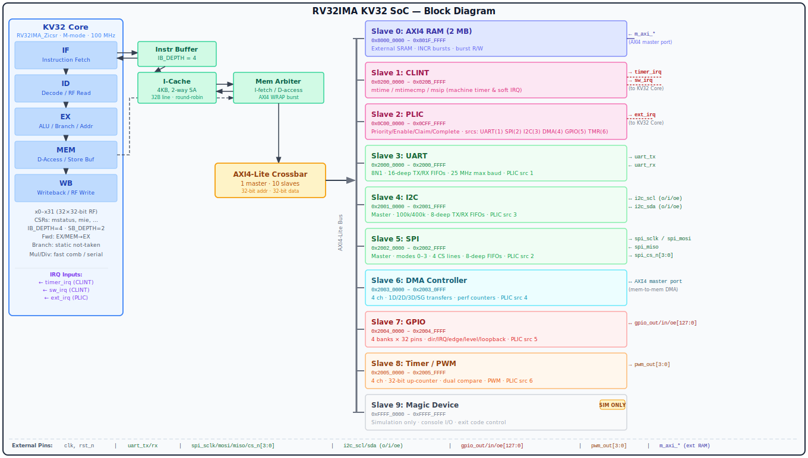

RISC-V 32-bit IMA Processor
============================

K<sub>V</sub>32 is a complete RISC-V 32-bit processor implementation with RV32IMA_Zicsr support, featuring a 5-stage pipeline, instruction cache, a 1-to-10 AXI4-Lite interconnect with nine on-chip peripherals, and both RTL and functional simulators.

## Features

### Core Features
- **ISA**: RV32IMA_Zicsr (Integer, Multiplication, Atomic, CSR extensions)
- **Pipeline**: 5-stage (Fetch, Decode, Execute, Memory, Writeback)
- **Hazard Handling**: Data forwarding, pipeline stalls, branch prediction
- **Privilege**: Machine mode (M-mode) support
- **CSRs**: Full CSR support including mstatus, mie, mtvec, mepc, mcause, etc.
- **Interrupts**: Timer, software, and external interrupt support
- **Exceptions**: Illegal instruction, ECALL, EBREAK, load/store faults

### System Features
- **Bus Interface**: AXI4-Lite 1-to-10 interconnect (single master, ten slaves)
- **Memory**: 2MB RAM at `0x8000_0000` with DPI-C access for ELF loading
- **Instruction Cache**: 2-way set-associative, 4 KB, 32-byte cache lines (configurable)
- **Power Management**: WFI-triggered clock gating via ICG cell (BUFGCE on Xilinx FPGA); auto-wakes on any pending M-mode interrupt (timer, software, external); IRQ pulse capture ensures single-cycle pulses are not missed; 1-cycle wake latency
- **Peripherals**:
  - CLINT — timer (`mtime`/`mtimecmp`) and software interrupts
  - PLIC — platform-level interrupt controller
  - UART — high-speed serial I/O (up to 25 Mbaud)
  - I2C — master controller
  - SPI — master controller with 4 chip-selects
  - GPIO — up to 128 configurable I/O pins
  - Timer/PWM — four independent 32-bit timers
  - DMA — memory-to-memory transfer engine
  - Magic — simulation console output and exit control
- **Simulation**:
  - Verilator-based RTL simulation with FST/VCD tracing
  - Fast functional ISA simulator (kv32sim) with GDB stub
  - ELF file loader for both simulators



## Memory Map

| Slave | Device | Base Address | End Address | Size | Description |
|-------|--------|--------------|-------------|------:|-------------|
| 0 | **RAM** | `0x8000_0000` | `0x801F_FFFF` | 2 MB | Main memory |
| 1 | **CLINT** | `0x0200_0000` | `0x020B_FFFF` | 768 KB | `mtime`, `mtimecmp`, software interrupt |
| 2 | **PLIC** | `0x0C00_0000` | `0x0CFF_FFFF` | 16 MB | Platform-level interrupt controller |
| 3 | **UART** | `0x2000_0000` | `0x2000_FFFF` | 64 KB | Serial I/O (up to 25 Mbaud) |
| 4 | **I2C** | `0x2001_0000` | `0x2001_FFFF` | 64 KB | I2C master controller |
| 5 | **SPI** | `0x2002_0000` | `0x2002_FFFF` | 64 KB | SPI master, 4 chip-selects |
| 6 | **DMA** | `0x2003_0000` | `0x2003_0FFF` | 4 KB | Memory-to-memory DMA engine |
| 7 | **GPIO** | `0x2004_0000` | `0x2004_FFFF` | 64 KB | Up to 128 configurable GPIO pins |
| 8 | **Timer/PWM** | `0x2005_0000` | `0x2005_FFFF` | 64 KB | Four independent 32-bit timers/PWM |
| 9 | **Magic** | `0xFFFF_0000` | `0xFFFF_FFFF` | 64 KB | Simulation console and exit control |

### Magic Device Registers

| Address | Name | Description |
|---------|------|-------------|
| `0xFFFF_FFF0` | `EXIT_MAGIC_ADDR` | Write any value to end simulation (exit code = value >> 1) |
| `0xFFFF_FFF4` | `CONSOLE_MAGIC_ADDR` | Write a byte to emit a character to the simulator console |

Refer to [docs/sdk_api_reference.adoc](docs/sdk_api_reference.adoc) and [docs/kv32_soc_datasheet.adoc](docs/kv32_soc_datasheet.adoc) for register-level details.

## Directory Structure

```
kv32/
├── rtl/                    # RTL source files
│   ├── core/              # Core processor modules
│   │   ├── kv32_pkg.sv    # Package definitions
│   │   ├── kv32_core.sv   # Top-level core
│   │   ├── kv32_alu.sv    # ALU
│   │   ├── kv32_decoder.sv # Instruction decoder
│   │   ├── kv32_regfile.sv # Register file
│   │   └── kv32_csr.sv    # CSR unit
│   ├── kv32_soc.sv        # SoC top-level
│   ├── axi_pkg.sv         # AXI definitions
│   ├── axi_xbar.sv        # AXI crossbar/interconnect
│   ├── axi_arbiter.sv     # AXI arbiter
│   ├── kv32_icache.sv     # 2-way set-associative instruction cache
│   ├── kv32_pm.sv         # Power manager (WFI clock gating, BUFGCE/ICG)
│   ├── axi_clint.sv       # CLINT (mtime/mtimecmp/msip)
│   ├── axi_plic.sv        # PLIC placeholder
│   ├── axi_uart.sv        # UART with AXI wrapper
│   ├── axi_i2c.sv         # I2C master controller
│   ├── axi_spi.sv         # SPI master controller
│   ├── axi_dma.sv         # DMA engine
│   ├── axi_gpio.sv        # GPIO controller
│   ├── axi_timer.sv       # Timer/PWM
│   ├── axi_magic.sv       # Simulation console and exit
│   ├── mem_axi.sv         # Memory to AXI bridge (read/write)
│   └── mem_axi_ro.sv      # Memory to AXI bridge (read-only, ICache bypass)
├── testbench/             # Testbench files
│   ├── tb_kv32_soc.sv     # SystemVerilog wrapper
│   ├── tb_kv32_soc.cpp    # Verilator C++ testbench
│   ├── axi_memory.sv      # 2MB memory with DPI-C
│   ├── elfloader.h        # ELF loader header
│   └── elfloader.cpp      # ELF loader implementation
├── sim/                   # Software simulator
│   ├── kv32sim.cpp        # Main simulator
│   ├── kv32sim.h          # Header
│   ├── riscv-dis.cpp      # Disassembler
│   └── Makefile           # Build file
├── sw/                    # Software directory
├── docs/                  # Documentation
│   ├── pipeline_architecture.md  # Pipeline design doc
│   └── pipeline_forwarding.svg   # Pipeline diagram
├── build/                 # Build outputs
│   ├── kv32soc            # Verilator simulator
│   └── kv32sim            # Software simulator
├── Makefile              # Main build system
└── env.config            # Environment configuration
```

## Quick Start

### Prerequisites
- Verilator 5.0+ (for RTL simulation)
- GCC/Clang with C++11 support
- RISC-V GCC toolchain (for compiling programs)
- Make

### Building

#### Build RTL Simulator
```bash
make build-rtl
```
This creates `build/kv32soc` Verilator simulator.

#### Build Software Simulator
```bash
make build-sim
```
This creates `build/kv32sim` functional simulator.

#### Build Both
```bash
make all
```

#### Clean Build
```bash
make clean
```

#### Debug Builds
For troubleshooting and development, enable debug messages:

```bash
# Build with debug enabled
DEBUG=1 make build-rtl

# Run test with debug
DEBUG=1 make rtl-simple
```

Debug messages show:
- Pipeline stage transitions (IF→ID→EX→MEM→WB)
- AXI bus transactions (read/write addresses and data)
- Memory operations
- Instruction execution details

#### Assertion Control
SystemVerilog assertions are enabled by default to verify design integrity. To disable assertions for faster simulation:

```bash
# Disable assertions (not recommended for debugging)
make ASSERT=0 rtl-simple
```

Assertions verify:
- **Core Pipeline**: PC alignment, register protection, data forwarding, hazard detection
- **Instruction Buffer**: FIFO integrity, overflow/underflow protection
- **Store Buffer**: State machine correctness, count consistency
- **SoC Integration**: AXI protocol compliance, memory interface correctness
- **X/Z Detection**: Unknown values on critical control signals

When an assertion fails, the simulator displays the error location and description.

### Running Simulations

#### Run Test Programs (Recommended)
```bash
make rtl-<test>    # Run test with RTL simulator
make sim-<test>    # Run test with software simulator
```
See [Testing](#testing) section for available tests and details.

#### Run RTL Simulation with ELF File
```bash
./build/kv32soc program.elf
```
- Generates `kv32soc.vcd` waveform file
- Outputs console text via magic address writes
- Exits when program writes to EXIT_MAGIC_ADDR

#### Run Software Simulator

```bash
Usage: ./kv32sim [options] <elf_file>
Options:
  --isa=<name>         Specify ISA (default: rv32ima_zicsr)
                       Supported: rv32ima, rv32ima_zicsr
  --trace              Enable Spike-format trace logging (alias for --log-commits)
  --log-commits        Enable Spike-format trace logging
  --rtl-trace          Enable RTL-format trace logging
  --log=<file>         Specify trace log output file (default: sim_trace.txt)
  +signature=<file>    Write signature to file (RISCOF compatibility)
  +signature-granularity=<n>  Signature granularity in bytes (1, 2, or 4, default: 4)
  -m<base>:<size>      Specify memory range (e.g., -m0x80000000:0x200000)
                       Default: -m0x80000000:0x200000 (2MB at 0x80000000)
  --instructions=<n>   Limit execution to N instructions (0 = no limit)
  --gdb                Enable GDB stub for remote debugging
  --gdb-port=<port>    Specify GDB port (default: 3333)
Examples:
  ./kv32sim program.elf
  ./kv32sim --log-commits --log=output.log program.elf
  ./kv32sim --rtl-trace --log=rtl_trace.txt program.elf
  ./kv32sim --log-commits -m0x80000000:0x200000 program.elf
  ./kv32sim --gdb --gdb-port=3333 program.elf
  ./kv32sim +signature=output.sig +signature-granularity=4 test.elf
```

#### View Waveforms
```bash
gtkwave kv32soc.vcd
```

## ELF File Loading

Both simulators support loading ELF files directly:

1. **RTL Simulator**: Uses DPI-C to load ELF segments into memory before simulation
2. **Software Simulator**: Parses ELF and loads into internal memory array

Example program usage:
```c
#include <stdint.h>

#define CONSOLE_MAGIC_ADDR 0xFFFFFFF4
#define EXIT_MAGIC_ADDR    0xFFFFFFF0

void print_char(char c) {
    *(volatile uint32_t*)CONSOLE_MAGIC_ADDR = c;
}

void exit_sim(int code) {
    *(volatile uint32_t*)EXIT_MAGIC_ADDR = code;
}

int main() {
    print_char('H');
    print_char('e');
    print_char('l');
    print_char('o');
    print_char('\n');
    exit_sim(0);
    return 0;
}
```

## Pipeline Architecture

### 5-Stage Pipeline
1. **IF (Instruction Fetch)**: Fetches instructions from memory via AXI
2. **ID (Instruction Decode)**: Decodes instructions, reads register file
3. **EX (Execute)**: ALU operations, branch resolution, CSR access
4. **MEM (Memory)**: Data memory access via AXI
5. **WB (Write Back)**: Writes results to register file

### Hazard Resolution
- **Data Hazards**: Forwarding from EX/MEM/WB stages
- **Load-Use Hazards**: Pipeline stall (1 cycle)
- **Control Hazards**: Branch prediction (not-taken), flush on mispredict
- **Structural Hazards**: Instruction/data arbitration via axi_arbiter

## CSR Registers

### Machine Mode CSRs
- `0x300` mstatus - Machine status
- `0x304` mie - Machine interrupt enable
- `0x305` mtvec - Machine trap vector
- `0x340` mscratch - Machine scratch register
- `0x341` mepc - Machine exception PC
- `0x342` mcause - Machine trap cause
- `0x343` mtval - Machine trap value
- `0x344` mip - Machine interrupt pending

### Counters
- `0xB00` mcycle - Cycle counter (lower 32 bits)
- `0xB80` mcycleh - Cycle counter (upper 32 bits)
- `0xB02` minstret - Instructions retired (lower 32 bits)
- `0xB82` minstreth - Instructions retired (upper 32 bits)

## AXI4-Lite Interface

The SoC uses AXI4-Lite for all peripheral accesses. The instruction-fetch path additionally uses AXI4 burst transfers (INCR/WRAP) for cache-line fills.

- **Address Width**: 32 bits
- **Data Width**: 32 bits
- **Byte Strobes**: 4 bits (byte/halfword/word access)
- **Response Codes**: OKAY, DECERR (unmapped addresses)
- **Topology**: single master → 10 slaves via `axi_xbar`
- **Bursts**: INCR/WRAP supported on the instruction port (ICache line fills)

## Development

### Environment Configuration
Edit `env.config` to set tool paths:
```bash
RISCV_PREFIX=/path/to/riscv-toolchain/bin/riscv32-unknown-elf-
VERILATOR=/usr/local/bin/verilator
```

### Adding New Peripherals
1. Create AXI slave module in `rtl/`
2. Add slave port to `axi_xbar.sv`
3. Update address decode logic
4. Instantiate in `kv32_soc.sv`
5. Update memory map documentation

## Testing

### Test Programs Structure

The `sw/` directory contains example test programs organized by folder:
- **common/**: Shared code, headers, and linker scripts
- **Other folders**: Each folder contains a specific test program

### Running Test Programs

Use the following make targets to run tests:

#### RTL Simulation
```bash
make rtl-<test>    # Run <test> with Verilator RTL simulation
```
Example:
```bash
make rtl-hello     # Run hello test with RTL simulator
make rtl-timer     # Run timer test with RTL simulator
```

#### Software Simulation
```bash
make sim-<test>    # Run <test> with fast software simulator
```
Example:
```bash
make sim-hello     # Run hello test with software simulator
make sim-timer     # Run timer test with software simulator
```

### Available Tests

Check the `sw/` directory for available test programs. Each subdirectory (except `common/`) represents a test that can be run with the above commands.

### Compiling Programs Manually

If you want to compile a program manually:
```bash
riscv32-unknown-elf-gcc -march=rv32ima_zicsr -mabi=ilp32 \
    -nostartfiles -T linker.ld -o program.elf program.c
```

**Important Notes:**
- The `_zicsr` extension is required for CSR instructions (mandatory in newer GCC versions)
- Floating-point `printf` support requires properly configured `libgcc` for RV32IMA
- Current common library provides: `puts()`, `putc()`, and basic console I/O via `_write()`
- For printf functionality, include `printf.c` from common/ and ensure `-lgcc` is added to link against compiler runtime

### Generated Files

When building test programs with `make <test>` or `make rtl-<test>`, the following files are generated in `build/`:
- **<test>.elf**: Executable ELF file
- **<test>.dis**: Disassembly listing (objdump output)
- **<test>.readelf**: ELF file information
- **kv32soc.vcd**: Waveform file (RTL simulation only)

### Debugging with GDB (Software Simulator)
```bash
# Terminal 1: Start simulator with GDB server
./build/kv32sim -g 3333 program.elf

# Terminal 2: Connect GDB
riscv32-unknown-elf-gdb program.elf
(gdb) target remote :3333
(gdb) break main
(gdb) continue
```

## Documentation

Detailed documentation is available in the [docs/](docs/) directory:

- **[Pipeline Architecture](docs/pipeline_architecture.md)**: Comprehensive guide to the 5-stage pipeline implementation, including:
  - Pipeline stage details (IF, ID, EX, MEM, WB)
  - Data forwarding and hazard handling
  - Pipeline registers and control flow
  - Performance characteristics
  - Visual pipeline diagram with forwarding paths

Additional documentation:
- Source code comments in RTL files
- Inline comments in test programs
- Debug output messages (enable with `DEBUG=1`)

## Performance

- **RTL Simulation**: ~100-500 Hz (depends on host)
- **Software Simulator**: ~1-10 MHz
- **Target FPGA Frequency**: 50-100 MHz

## Known Limitations

- Single-issue, in-order pipeline
- Instruction cache only — no data cache (D-cache); all data accesses go directly to the AXI bus
- No MMU / virtual memory
- No floating-point unit
- CSR support limited to M-mode

## License

See LICENSE file for details.

## References

- [RISC-V Instruction Set Manual](https://riscv.org/technical/specifications/)
- [RISC-V Privileged Architecture](https://riscv.org/technical/specifications/)
- [Verilator User Guide](https://verilator.org/guide/latest/)
- [AXI4-Lite Protocol Specification](https://developer.arm.com/documentation/)

## Contributing

Contributions are welcome! Please ensure:
1. Code follows existing style
2. All tests pass
3. Documentation is updated
4. Commit messages are descriptive

## Authors

See git history for contributors.

