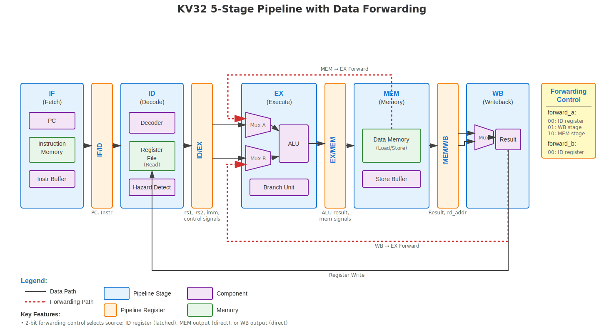

# KV32 Pipeline Architecture

## Overview

The KV32 core implements a classic 5-stage RISC pipeline with data forwarding to minimize stalls and maximize instruction throughput. This document describes the pipeline architecture, forwarding mechanism, and hazard handling strategies.

## Pipeline Diagram



## Pipeline Stages

### 1. IF (Instruction Fetch)

**Purpose**: Fetch instructions from instruction memory.

**Components**:
- **Program Counter (PC)**: Holds the address of the next instruction to fetch
- **Instruction Memory Interface**: AXI read interface to memory
- **Instruction Buffer**: Tracks outstanding instruction fetch requests (depth configurable via `IB_DEPTH` parameter)

**Key Features**:
- Supports multiple outstanding instruction fetches (default: 2)
- Handles fetch backpressure from memory system
- PC update priority:
  1. Exception/Interrupt → `mtvec`
  2. MRET instruction → `mepc`
  3. Branch taken → `branch_target`
  4. Sequential → `PC + 4`

**Pipeline Register Output**: IF/ID register latches:
- `pc_id`: Program counter
- `instr_id`: Fetched instruction
- `id_valid`: Valid instruction flag
- `instr_access_fault_id`: Instruction fetch error flag

### 2. ID (Instruction Decode)

**Purpose**: Decode instruction and read source registers.

**Components**:
- **Instruction Decoder** (`kv32_decoder`): Decodes 32-bit RISC-V instruction into control signals
- **Register File** (`kv32_regfile`): 32 general-purpose registers (x0-x31), x0 hardwired to zero
- **Hazard Detection**: Detects load-use hazards

**Outputs**:
- Register addresses: `rs1_addr`, `rs2_addr`, `rd_addr`
- Register data: `rs1_data`, `rs2_data`
- Immediate value: `imm`
- Control signals: ALU operation, memory operation, branch type, etc.

**Hazard Detection**:
- **Load-Use Hazard**: Stalls pipeline when an instruction reads a register being loaded by the previous instruction
- Stall condition: `(mem_read_ex && ((rd_addr_ex == rs1_addr) || (rd_addr_ex == rs2_addr)))`

**Pipeline Register Output**: ID/EX register latches:
- Source register data: `rs1_data_ex`, `rs2_data_ex`
- Immediate value: `imm_ex`
- Register addresses: `rs1_addr_ex`, `rs2_addr_ex`, `rd_addr_ex`
- All control signals for later stages

### 3. EX (Execute)

**Purpose**: Perform ALU operations, evaluate branches, and compute addresses.

**Components**:
- **Forwarding Multiplexers**: Select operand sources (register file, MEM stage, or WB stage)
- **ALU** (`kv32_alu`): Arithmetic, logical, shift, multiply, and divide operations
- **Branch Unit**: Evaluates branch conditions and computes branch targets

**Data Forwarding**:

The EX stage implements data forwarding to resolve Read-After-Write (RAW) hazards. Two forwarding multiplexers select the actual operand values:

```systemverilog
// Forwarding control encoding:
forward_a, forward_b:
  00: Use latched value from ID/EX register (rs1_data_ex, rs2_data_ex)
  01: Forward from WB stage (alu_result_wb or mem_data_wb)
  10: Forward from MEM stage (alu_result_mem)
```

**Forwarding Priority** (for rs1, same logic applies to rs2):
1. **MEM stage** (highest priority): If MEM stage will write to rs1's register
2. **WB stage**: If WB stage will write to rs1's register
3. **ID register** (no forwarding): Use latched value from register file

**Operand Selection**:
- **Operand A**: `PC` (for AUIPC) or forwarded `rs1`
- **Operand B**: `imm` (immediate instructions) or forwarded `rs2`

**Branch Evaluation**:
- Supports all 6 RISC-V branch types: BEQ, BNE, BLT, BGE, BLTU, BGEU
- Branch prediction: **always not-taken** (flush pipeline on misprediction)
- Branch target calculation:
  - JALR: `(rs1 + imm) & ~1` (clear LSB per RISC-V spec)
  - JAL/Branch: `PC + imm` (PC-relative)

**Multi-Cycle Operations**:
- Multiply and divide operations may take multiple cycles
- ALU asserts `ready=0` while busy, causing `id_ex_stall`

**Pipeline Register Output**: EX/MEM register latches:
- `alu_result_mem`: ALU result or return address (PC+4 for JAL/JALR)
- `rs2_data_mem`: Store data (with forwarding applied)
- `rd_addr_mem`: Destination register address
- Memory control signals: `mem_read_mem`, `mem_write_mem`, `mem_op_mem`

### 4. MEM (Memory Access)

**Purpose**: Perform load and store operations to data memory.

**Components**:
- **Data Cache** (`kv32_dcache`): Optional write-back set-associative data cache (present when `DCACHE_EN=1`). Provides 1-cycle hit latency for loads/stores; handles dirty-line eviction and CMO operations
- **Data Memory Interface**: AXI read/write interface; accessed directly when D-cache is disabled, or only on D-cache misses / dirty evictions when enabled
- **Store Buffer** (`kv32_sb`): Asynchronous store completion buffer (depth configurable via `SB_DEPTH` parameter)
- **Load/Store Data Encoding**: Handles byte/halfword/word alignment and sign extension

**Store Buffer**:
- Allows stores to complete without blocking the pipeline
- FIFO buffer holds pending stores (default depth: 2)
- Stores are issued to memory (or D-cache) in order
- Flushed on exceptions/branches to maintain precise exceptions
- When D-cache is enabled, the store buffer drains store data into the D-cache (which handles write-back or write-through to main memory)

**Memory Request Routing**:
- **Loads**: Go directly to memory (but stall if stores are pending to prevent RAW hazards)
- **Stores**: Go through store buffer for asynchronous completion

**Load/Store Data Handling**:

**Store Encoding**:
- Byte store: Replicate byte to all 4 positions, set byte enable based on `addr[1:0]`
- Halfword store: Replicate halfword to both positions, set enables based on `addr[1]`
- Word store: Full 32-bit write with all byte enables set

**Load Decoding**:
- Extract byte/halfword from 32-bit memory word based on `addr[1:0]`
- Apply sign or zero extension based on load type (LB, LBU, LH, LHU, LW)

**RAW Hazard Prevention**:
- Loads stall when any stores are pending in the store buffer
- This conservative approach prevents reading stale data
- More aggressive implementations could forward from store buffer
- When D-cache is enabled, D-cache hit loads complete in 1 cycle and do not interact with store-buffer forwarding (the store buffer drains before loads are issued to the D-cache)

**Pipeline Register Output**: MEM/WB register latches:
- `alu_result_wb`: ALU result (used for non-memory instructions)
- `mem_data_wb`: Aligned and sign-extended load data
- `rd_addr_wb`: Destination register address
- `reg_we_wb`: Register write enable
- `mem_read_wb`: Memory read indicator

### 5. WB (Writeback)

**Purpose**: Write results back to register file and retire instructions.

**Components**:
- **Result Multiplexer**: Selects between ALU result and memory data
- **Register File Write Port**: Writes to destination register

**Result Selection**:
```systemverilog
rd_data = mem_read_wb ? mem_data_wb : alu_result_wb
```

**Instruction Retirement**:
- Valid instruction in WB stage increments `instret_counter`
- Performance counters track:
  - `cycle_count`: Total cycles
  - `instret_count`: Instructions retired
  - `stall_count`: Cycles stalled
  - `first_retire_cycle`: Cycle of first instruction retirement
  - `last_retire_cycle`: Cycle of last instruction retirement

**Exception Detection**:
- Data access faults detected in WB stage
- Late exceptions cause pipeline flush and trap to handler

## Pipeline Registers

Pipeline registers latch results at each stage boundary and can be stalled or flushed:

| Register | PC Register | Valid Signal | Latches | Can Stall | Can Flush |
|----------|-------------|--------------|---------|-----------|-----------|
| **IF/ID** | `pc_id` | `id_valid` | PC, instruction | Yes (`if_id_stall`) | Yes (`if_flush`, `id_flush`) |
| **ID/EX** | `pc_ex` | `ex_valid` | Decoded signals, register data | Yes (`id_ex_stall`) | Yes (`ex_flush`, `id_flush`) |
| **EX/MEM** | `pc_mem` | `mem_valid` | ALU result, memory signals | Yes (`ex_mem_stall`) | Yes (`mem_flush`) |
| **MEM/WB** | `pc_wb` | `wb_valid` | Final result, register address | Yes (`mem_wb_stall`) | No (relies on propagated valid) |

### Stall vs. Flush

- **Stall**: Hold current value, inject bubble (NOP) into next stage
- **Flush**: Clear pipeline stage, invalidate instruction

## Forwarding Implementation

### Forwarding Logic

The core implements **EX-stage forwarding** to eliminate most RAW hazards:

```systemverilog
// Forward rs1 if RAW hazard detected
if (reg_we_mem && (rd_addr_mem != 0) && (rd_addr_mem == rs1_addr_ex)) begin
    forward_a = 2'b10;  // Forward from MEM stage (direct output)
end else if (reg_we_wb && (rd_addr_wb != 0) && (rd_addr_wb == rs1_addr_ex)) begin
    forward_a = 2'b01;  // Forward from WB stage (direct output)
end else begin
    forward_a = 2'b00;  // Use latched register value from ID stage
end
```

### When Forwarding Cannot Help

**Load-Use Hazard**: Forwarding cannot eliminate this hazard because load data is not available until MEM stage, but the next instruction needs it in EX stage.

Example:
```assembly
lw  x1, 0(x2)    # Load in MEM stage
add x3, x1, x4   # Needs x1 in EX stage (one cycle too early!)
```

**Solution**: Pipeline stalls for one cycle, injecting a bubble between the load and dependent instruction.

## Hazard Summary

| Hazard Type | Detection | Resolution |
|-------------|-----------|------------|
| **RAW (Data)** | Compare register addresses | Data forwarding from MEM/WB to EX |
| **Load-Use** | Load in EX, dependent instruction in ID | Stall pipeline (inject bubble) |
| **Control (Branch)** | Branch evaluation in EX | Flush IF and ID stages on misprediction |
| **Memory Backpressure** | Memory not ready | Stall appropriate stage |
| **D-Cache Miss** | Cache lookup miss | Stall MEM stage until fill completes (CWF optimisation) |
| **Store-Load** | Store pending in buffer | Stall load until stores complete |

## Design Philosophy

### Latched Results with Bypass

The pipeline follows the principle:
- **Each stage latches outputs to pipeline registers** for timing closure and state holding
- **Forwarding paths bypass registers** for back-to-back operations when data is available
- This provides the best of both worlds:
  - **Timing**: Registers break long combinational paths
  - **Performance**: Forwarding avoids unnecessary stalls

### Why IF/ID Doesn't Need Forwarding

The instruction path (IF stage) does not implement forwarding because:
1. **No data dependencies**: Instructions don't have RAW hazards like register reads do
2. **Sequential flow**: Instructions flow linearly through the pipeline
3. **Instruction buffer**: Handles fetch latency, not bypass logic

Only the **data path** (register file reads in ID, ALU execution in EX) needs forwarding to resolve RAW hazards.

## Configuration Parameters

| Parameter | Default | Description |
|-----------|---------|-------------|
| `IB_DEPTH` | 2 | Instruction buffer depth (outstanding instruction fetches) |
| `SB_DEPTH` | 2 | Store buffer depth (buffered stores awaiting memory completion) |
| `DCACHE_EN` | 0 | 1 = enable data cache (`kv32_dcache`); 0 = all loads/stores go directly to AXI |
| `DCACHE_SIZE` | 4096 | Data cache capacity in bytes (power of 2) |
| `DCACHE_LINE_SIZE` | 32 | Data cache line size in bytes |
| `DCACHE_WAYS` | 2 | Data cache associativity |
| `DCACHE_WRITE_BACK` | 1 | 1 = write-back; 0 = write-through |
| `DCACHE_WRITE_ALLOC` | 1 | 1 = write-allocate on store miss; 0 = no-allocate bypass |

Higher depths allow more outstanding operations but increase area and latency.

## Exception Handling

The pipeline supports **precise exceptions**:

1. **Exception Detection**:
   - Synchronous exceptions detected in EX stage
   - Memory exceptions detected in MEM/WB stages

2. **Exception Priority** (highest to lowest):
   - Instruction access fault
   - Illegal instruction
   - ECALL (environment call)
   - EBREAK (breakpoint)
   - Load/store address misaligned
   - Load/store access fault

3. **Exception Response**:
   - Flush pipeline stages
   - Save PC and cause in CSRs (`mepc`, `mcause`, `mtval`)
   - Jump to exception handler (`mtvec`)
   - Pipeline resumes from handler

4. **MRET (Return from Trap)**:
   - Evaluated in EX stage
   - Restores PC from `mepc`
   - Restores interrupt enable state

## Performance Characteristics

**Best Case** (no hazards):
- **CPI = 1.0**: One instruction completes per cycle

**Common Stalls**:
- **Load-use hazard**: +1 cycle bubble
- **Branch misprediction**: +2 cycles (flush IF and ID stages)
- **Memory backpressure**: Variable cycles depending on memory latency; reduced to ~0 extra cycles when D-cache is enabled and access is a hit
- **D-cache miss**: Memory latency + 1 cycle (critical-word-first fill); dirty eviction adds one additional memory round-trip
- **Multi-cycle ALU**: Variable cycles (multiply: 2-3 cycles, divide: up to 34 cycles)

**Typical CPI**: 1.2–1.5 for most code without caches; 1.1–1.3 with both I-cache and D-cache enabled (reduces memory-backpressure stalls significantly)

## Related Files

- **Core**: [rtl/core/kv32_core.sv](../rtl/core/kv32_core.sv)
- **ALU**: [rtl/core/kv32_alu.sv](../rtl/core/kv32_alu.sv)
- **Decoder**: [rtl/core/kv32_decoder.sv](../rtl/core/kv32_decoder.sv)
- **Register File**: [rtl/core/kv32_regfile.sv](../rtl/core/kv32_regfile.sv)
- **Instruction Buffer**: [rtl/core/kv32_ib.sv](../rtl/core/kv32_ib.sv)
- **Store Buffer**: [rtl/core/kv32_sb.sv](../rtl/core/kv32_sb.sv)
- **CSR**: [rtl/core/kv32_csr.sv](../rtl/core/kv32_csr.sv)

## References

- [RISC-V Unprivileged ISA Specification](https://riscv.org/technical/specifications/)
- [RISC-V Privileged ISA Specification](https://riscv.org/technical/specifications/)
- "Computer Architecture: A Quantitative Approach" by Hennessy & Patterson
- "Computer Organization and Design: The Hardware/Software Interface" RISC-V Edition
